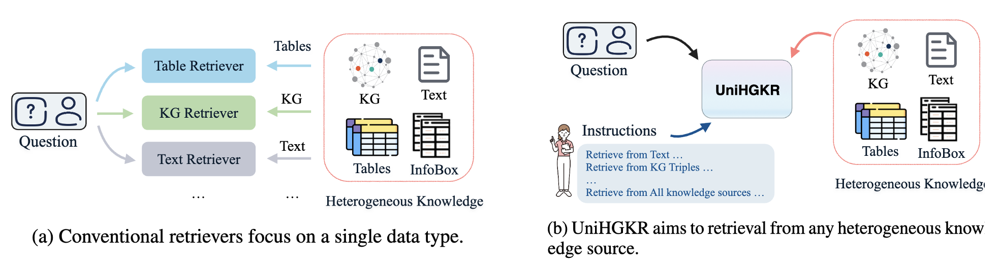

<h2 align="center"> <a href="https://arxiv.org/abs/2410.20163">UniHGKR: Unified Instruction-aware Heterogeneous Knowledge Retrievers (NAACL 2025 Oral)</a></h2>


<h5 align="center">

[](https://arxiv.org/abs/2410.20163)
<a href="https://huggingface.co/collections/ZhishanQ/unihgkr-6846b60973fa75b04681a388"></a>

</h5>

🌟 This is the official repository for Dense Heterogeneous Knowledge Retrievers: **UniHGKR**, and the heterogeneous knowledge retrieval benchmark **CompMix-IR**.



## Abstract

Existing information retrieval (IR) models often assume a homogeneous structure for knowledge sources and user queries, limiting their applicability in real-world settings where retrieval is inherently heterogeneous and diverse.
In this paper, we introduce UniHGKR, a unified instruction-aware heterogeneous knowledge retriever that (1) builds a unified retrieval space for heterogeneous knowledge and (2) follows diverse user instructions to retrieve knowledge of specified types. 
UniHGKR consists of three principal stages: heterogeneous self-supervised pretraining, text-anchored embedding alignment, and instruction-aware retriever fine-tuning, enabling it to generalize across varied retrieval contexts. This framework is highly scalable, with a BERT-based version and a UniHGKR-7B version trained on large language models. 
Also, we introduce CompMix-IR, the first native heterogeneous knowledge retrieval benchmark. It includes two retrieval scenarios with various instructions, over 9,400 question-answer (QA) pairs, and a corpus of 10 million entries, covering four different types of data.
Extensive experiments show that UniHGKR consistently outperforms state-of-the-art methods on CompMix-IR, achieving up to 6.36% and 54.23% relative improvements in two scenarios, respectively.
Finally, by equipping our retriever for open-domain heterogeneous QA systems, we achieve a new state-of-the-art result on the popular [ConvMix](https://convinse.mpi-inf.mpg.de/) task, with an absolute improvement of up to 4.80 points.


## 🚀🚀 News:

- UniHGKR 3 stages training data are released at [🤗UniHGKR_training_data](https://huggingface.co/datasets/ZhishanQ/UniHGKR_training_data).

- Training code for UniHGKR-base/UniHGKR-7B are released at [here](#3-code-to-train-and-evalutation).

## 1. CompMix-IR Benchmark

For more detailed information about the CompMix-IR Benchmark, please refer to the [CompMix_IR](https://github.com/ZhishanQ/UniHGKR/tree/main/CompMix_IR) directory.

### 1.1 Corpus of CompMix-IR:

Download from 🤗 HuggingFace Dataset: [Link](https://huggingface.co/datasets/ZhishanQ/CompMix-IR).

The complete version of the CompMix_IR heterogeneous knowledge corpus is approximately 3-4 GB in size. We also provide a smaller file, which is a subset, to help readers understand its content and structure: [subset of corpus](https://github.com/ZhishanQ/UniHGKR/tree/main/CompMix_IR/subset_kb_wikipedia_mixed_rd.json).


### 1.2 QA pairs of CompMix:

CompMix QA pairs: [CompMix](https://github.com/ZhishanQ/UniHGKR/tree/main/CompMix_IR/CompMix)

ConvMix QA pairs: [ConvMix_annotated](https://github.com/ZhishanQ/UniHGKR/tree/main/CompMix_IR/ConvMix_annotated)

or 🤗Huggingface dataset: 
[CompMix](https://huggingface.co/datasets/pchristm/CompMix), [ConvMix](https://huggingface.co/datasets/pchristm/ConvMix)

### 1.3 Code to evaluate 

Code to evaluate whether the retrieved evidence is positive to the question:

[Code to judge relevance](https://github.com/ZhishanQ/UniHGKR/tree/main/CompMix_IR/eval_part)

### 1.4 Data-Text Pairs 

It is used in training stages 1 and 2.

Download from 🤗 HuggingFace Dataset: [Link](https://huggingface.co/datasets/ZhishanQ/UniHGKR_Date_Text_Pairs/tree/main).

The complete version of Data-Text Pairs is about 1.2 GB. We also provide a smaller file, which is a subset, to help readers understand its content and structure: [subset of data-text pairs](https://github.com/ZhishanQ/UniHGKR/tree/main/CompMix_IR/data_2_text_subset.json)

The [CompMix_IR](https://github.com/ZhishanQ/UniHGKR/tree/main/CompMix_IR) directory provides detailed explanations for the keys within each dict item.

## 2. UniHGKR model checkpoints
 
| Mdeol Name            | Description                                                                                                                | 🤗 Huggingface  Link                                                              | Usage Example                                                                                                         |
|-----------------------|----------------------------------------------------------------------------------------------------------------------------|--------------------------------------------------------------------------------|-----------------------------------------------------------------------------------------------------------------------|
| UniHGKR-base          | adapted for evaluation on CompMix-IR                                                                                       | [UniHGKR-base](https://huggingface.co/ZhishanQ/UniHGKR-base)                   | [demo code to use](https://github.com/ZhishanQ/UniHGKR/tree/main/code_for_UniHGKR_base)                               |
| UniHGKR-base-beir     | adapted for evaluation on BEIR                                                                                             | [UniHGKR-base-beir](https://huggingface.co/ZhishanQ/UniHGKR-base-beir)         | [code for evaluation_beir](https://github.com/ZhishanQ/UniHGKR/tree/main/evaluation_beir)                             | 
| UniHGKR-7B            | LLM-based retriever                                                           | [UniHGKR-7B](https://huggingface.co/ZhishanQ/UniHGKR-7B)                |                                 [demo code to use](https://github.com/ZhishanQ/UniHGKR/tree/main/code_for_UniHGKR_7B) |
| UniHGKR-7B-pretrained | The model was trained after Stages 1 and 2. It needs to be fine-tuned before being used for an information retrieval task. | [UniHGKR-7B-pretrained](https://huggingface.co/ZhishanQ/UniHGKR-7B-pretrained) |                                                                                                                       |


## 3. Code to train and evalutation

### Environment

- **UniHGKR-base**: please use this environment,[FlagEmbedding](https://github.com/FlagOpen/FlagEmbedding/tree/master/research/baai_general_embedding).

- **UniHGKR-7B**: please use this environment,[LLARA](https://github.com/FlagOpen/FlagEmbedding/tree/master/research/LLARA).


### 3.1 Download training dataset

[🤗UniHGKR_training_data](https://huggingface.co/datasets/ZhishanQ/UniHGKR_training_data) includes all the files that are needed during our model's training. Please put the `UniHGKR_training_data` in the `src_for_train`.

**Tips:**

1. Execute the following shell command in the `src_for_train` folder:
2. Ensure that the `logs` directory exists; otherwise, log files may not be generated properly. If the directory does not exist, you can create it using the command `mkdir -p logs`.  
3. It is recommended to save the script content as a `.sh` file, such as `run_experiments.sh`. Add execute permission to the file: `chmod +x run_experiments.sh`.

### 3.1 Train UniHGKR-base

**Training Stage 1:**
``` shell
nohup torchrun --nnodes=1 --nproc_per_node 8  --master_port='29581' \
-m baai_general_embedding.retromae_pretrain.run \
--output_dir your_path_to_stage_1_pretrained_model\
--model_name_or_path your_path_to_bert-base-uncased \
--train_data UniHGKR_training_data/data_text_pretrain_shuffled.jsonl \
--learning_rate 2e-5 \
--fp16 \
--num_train_epochs 1 \
--per_device_train_batch_size 64 \
--dataloader_drop_last True \
--max_seq_length 512 \
--logging_steps 30 \
--save_strategy steps \
--save_steps 1000000 \
--save_total_limit 1 \
--dataloader_num_workers 10  > logs/bert-base-uncased-pretrain_v1.log 2>&1 &
```

Note: 
Please change `nproc_per_node` according to the number of your GPUs and adjust `per_device_train_batch_size` based on the size of GPU Memory. `master_port` is the port in Torchrun. If you use Torchrun to run multiple training programs simultaneously, please set different ports.

**Training Stage 2:**
``` shell
nohup torchrun --nnodes=1 --nproc_per_node 8  --master_port='29221' \
-m baai_general_embedding.finetune.run \
--output_dir your_path_to_save_stage_2_trained_model/ \
--model_name_or_path your_path_to_stage_1_pretrained_model/encoder_model \
--train_data UniHGKR_training_data/data_text_finetune.jsonl \
--learning_rate 1e-5 \
--fp16 \
--num_train_epochs 1 \
--per_device_train_batch_size 96 \
--dataloader_drop_last True \
--normlized True \
--temperature 0.02 \
--query_max_len 256 \
--passage_max_len 256 \
--train_group_size 2 \
--negatives_cross_device \
--logging_steps 10 \
--save_strategy steps \
--save_steps 1000000 \
--save_total_limit 1 \
--use_inbatch_neg True \
--query_instruction_for_retrieval ""  > logs/stage_2_finetuning.log 2>&1 &
```

**Training Stage 3:**

``` shell
nohup torchrun --nnodes=1 --nproc_per_node 8  --master_port='29221' \
-m baai_general_embedding.finetune.run \
--output_dir  your_path_to_save_stage_3_trained_model\
--model_name_or_path your_path_to_save_stage_2_trained_model \
--train_data UniHGKR_training_data/stage_3_ft_data.jsonl \
--learning_rate 2e-5 \
--fp16 \
--num_train_epochs 5 \
--per_device_train_batch_size 32 \
--dataloader_drop_last True \
--normlized True \
--temperature 0.02 \
--query_max_len 256 \
--passage_max_len 256 \
--train_group_size 16 \
--negatives_cross_device \
--logging_steps 10 \
--save_strategy steps \
--save_steps 1000000 \
--save_total_limit 1 \
--use_inbatch_neg True \
--query_instruction_for_retrieval ""  > logs/stage_3_finetuning.log 2>&1 &
```


### 3.2 Evaluate UniHGKR-base on CompMix-IR

**Step 1: semantic retrieval**

``` shell
models=("ZhishanQ/UniHGKR-base")

sources=("all" "kb" "info" "table" "text")
# sources=("all")
corpus_id=0
# save_embedding : Whether to cache embeddings. 
# Change batch_size according to your GPU memory.

for model in "${models[@]}"; do
    for i in {0..4}; do  # Change this number 4 according to your GPU number.
        source1=${sources[i]}
        gpu_id=${i}  # use GPU 0, 1, 2, 3, 4;
        nohup python -u ST_code_util_mgpu_batch_ins.py --gpus ${gpu_id} \
        --model_name ${model} \
        --convmix_test_set test \
        --save_embedding 0 \
        --use_domain_tips 1 \
        --use_diverse_ins 0 \
        --corpus_id 0 \
        --debug_flag 0 \
        --batch_size 256 \
        --use_single_source ${source1} > logs/${model}_${source1}_${corpus_id}_wo_use_diverse_ins.log 2>&1 &
    done
done
```

**Step 2: Retrieval performance evaluation**
``` shell

models=("ZhishanQ/UniHGKR-base")
sources=("all" "kb" "text" "table" "info")
corpus_ids=(0)
for model in "${models[@]}"; do
    for source1 in "${sources[@]}"; do
        for corpus_id in "${corpus_ids[@]}"; do
            python ans_presence_eval_for_source.py  \
            --model_name_base ${model} \
            --convmix_test_set test \
            --corpus_id ${corpus_id} \
            --use_single_source ${source1} 
            wait
            echo -e "\n\n\n"
        done
    done
done
```

### 3.3 Evalutation on Convmix

Step 1: convert the retrieved evidence and question pairs into the format required for convmix evaluation, or use our saved file for UniHGKR_base model in `UniHGKR_training_data/uniHGKR_base_for_convinse_test_eval.json`

``` shell
python src_for_train/convert_for_ers_format.py --model_name_base "UniHGKR-base" --convmix_test_set "test"
```

Step 2: use this file to replace the retrieved evidence part in the [CONVINSE official code](https://github.com/PhilippChr/CONVINSE). 


### 3.4 Evalutation on BERI

Our variant model **UniHGKR-base-beir** adapted for evaluation on BEIR can be found at: https://huggingface.co/ZhishanQ/UniHGKR-base-beir

The code for evaluation on BEIR at: [evaluation_beir](https://github.com/ZhishanQ/UniHGKR/tree/main/evaluation_beir).

### 3.5 Reproduce the evaluation results of the BM25 model on CompMix-IR


Because the bm25 model with cpu is too slow, we split the questions into 5 parts and process them separately. 
 
``` shell
#!/bin/bash

for i in {0..4}
do
    nohup python -u ST_code_bm25.py --gpus 0 --convmix_test_set test --part $i > logs/bm25_on_test_set_part$i.log 2>&1 &
done

```

Then, run this code to merge them.
``` shell
python merge_bm25.py
```


### 3.6 Train UniHGKR-7B

**Step 1: Pretrain**

Execute the following command in the `src_for_train/UniHGKR-7B-train_code/pretrain` directory, or directly use the pretrained model weights provided in [UniHGKR-7B-pretrained](https://huggingface.co/ZhishanQ/UniHGKR-7B-pretrained) in the finetuning stage.

``` shell
output_model_name="UniHGKR-7B-pretrained"
llm_pretrain_data="../../UniHGKR_training_data/UniHGKR_7b_pretrain_data.jsonl"

nohup torchrun --nproc_per_node 8 \
run.py \
--output_dir ./${output_model_name} \
--model_name_or_path BAAI/LLARA-pretrain \
--train_data ${llm_pretrain_data} \
--learning_rate 1e-5 \
--num_train_epochs 1 \
--per_device_train_batch_size 384 \
--gradient_accumulation_steps 1 \
--dataloader_drop_last True \
--cutoff_len 128 \
--logging_steps 1 \
--save_steps 500000 \
--save_total_limit 1 \
--gradient_checkpointing \
--ddp_find_unused_parameters False \
--use_flash_attn False \
--deepspeed ../stage1.json \
--warmup_ratio 0.1 \
--remove_stop_words True \
--use_lora False \
--bf16 \
--cache_dir ./LMs \
--token ... > logs/${output_model_name}.log 2>&1 &
```

**Step 2: finetune**

Execute the following command in the `src_for_train/UniHGKR-7B-train_code/finetune` directory, or directly use the pretrained model weights provided in [UniHGKR-7B](https://huggingface.co/ZhishanQ/UniHGKR-7B).

``` shell
base_model="../pretrain/UniHGKR-7B-pretrained"
output_model_name="UniHGKR-7B"
dataset_file="../../UniHGKR_training_data/UniHGKR_7b_finetune_data.jsonl"

nohup torchrun --nproc_per_node 8 \
run.py \
--output_dir ./${output_model_name} \
--model_name_or_path ${base_model} \
--train_data ${dataset_file} \
--learning_rate 2e-4 \
--num_train_epochs 1 \
--per_device_train_batch_size 64 \
--dataloader_drop_last True \
--normlized True \
--temperature 0.01 \
--query_max_len 64 \
--passage_max_len 160 \
--train_group_size 8 \
--logging_steps 10 \
--save_steps 50000 \
--save_total_limit 1 \
--ddp_find_unused_parameters False \
--negatives_cross_device \
--gradient_checkpointing \
--deepspeed ../stage1.json \
--warmup_ratio 0.1 \
--fp16 \
--cache_dir ./LMs \
--token ...  > logs/${output_model_name}.log 2>&1 &
```

### 3.7 Evaluate UniHGKR-7B on CompMix-IR


**Step 1: split the corpus to small parts and generate embedding**

Since the embedding dimension generated by the 7B model is larger, we need to divide the corpus into multiple small chunks and process each chunk separately for embedding, to avoid the program exceeding the system memory.
For instance, in our experimental setup, we have 8 GPUs, so we divided it into 8 parts.
``` shell
python split_corpus.py
```

then:
``` shell
./run_UniHGKR_7B_for_compmix_embedding.sh
```

then:
``` shell
python merge_split_embedding.py
```

**Step 2: semantic retrieval**
``` shell
./UniHGKR-7B_semantic_retrieve.sh
```

**Step 3: UniHGKR-7B retrieval performance evaluation**

We can use the same scripts and codes as UniHGKR-base for this part.


## ✏️ Citation
If you find our paper and resource useful in your research, please consider giving a star :star: and citation :pencil:.

```
@inproceedings{min-etal-2025-unihgkr,
    title = "{U}ni{HGKR}: Unified Instruction-aware Heterogeneous Knowledge Retrievers",
    author = "Min, Dehai  and
      Xu, Zhiyang  and
      Qi, Guilin  and
      Huang, Lifu  and
      You, Chenyu",
    editor = "Chiruzzo, Luis  and
      Ritter, Alan  and
      Wang, Lu",
    booktitle = "Proceedings of the 2025 Conference of the Nations of the Americas Chapter of the Association for Computational Linguistics: Human Language Technologies (Volume 1: Long Papers)",
    month = apr,
    year = "2025",
    address = "Albuquerque, New Mexico",
    publisher = "Association for Computational Linguistics",
    url = "https://aclanthology.org/2025.naacl-long.234/",
    doi = "10.18653/v1/2025.naacl-long.234",
    pages = "4577--4594",
    ISBN = "979-8-89176-189-6"
}
```

## 📧 contact
```
Dehai Min, dmin10@uic.edu
```

